# 💫 About Me:

🔭 I’m currently: A B.Tech CSE student specializing in Cybersecurity and developing automated security solutions.  🎓 Certified Professional: Officially certified in Networking, Linux, Ethical Hacking, and Penetration Testing.  👯 I’m looking to work as: An AI Pentesting & Penetration Tester, focused on integrating machine learning with advanced exploitation techniques.  🌱 I’m currently learning: High-level Python automation for security workflows and C programming for system-level vulnerability research.  💬 Ask me about: Web Pentesing or vulnerability assessment.  ⚡ Mindset: Always hunting for the next vulnerability. If it’s connected, it’s a target.

# 💻 Tech Stack:

  

# 📊 GitHub Stats:

 

 

🏆 GitHub Trophies
---

  
<table>
  <tr>
    <td valign="top" width="370">
       
    </td>
    <td valign="top"></td>
  </tr>
</table>

### ✍️ Random Dev Quote

### 🔝 Top Contributed Repo

---

